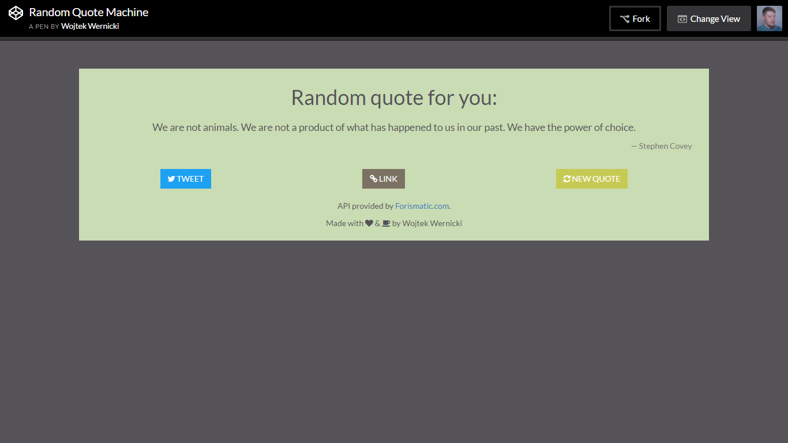

# Random Quote Machine
I made this project during [Free Code Camp](https://www.freecodecamp.com/) course. Check demo on [CodePen](http://codepen.io/WojtekWernicki/full/NAkBBv/).

Used languages, libraries and services:

- HTML5
- CSS3
  - Flexbox
- JavaScript
  - jQuery
- Bootstrap 3.3.6
- FontAwesome 4.6.3
- Google Fonts &mdash; Lato
- [Forismatic API](http://forismatic.com/en/api/)

Things I learned during this project:

- Flexbox
- Processing data from API in JavaScript (jQuery)

This project is licensed under MIT license, check [LICENSE](LICENSE) for more details.